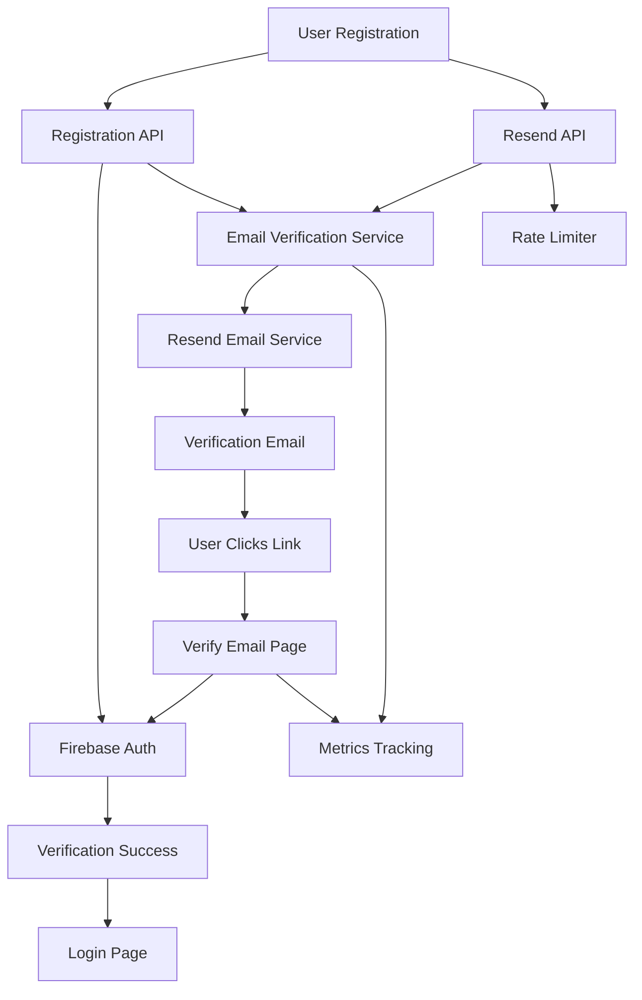
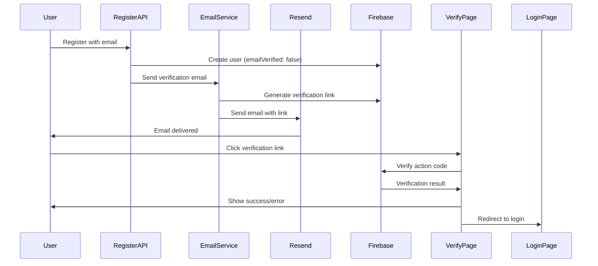

# Email Verification System - Readiness Checklist

This document provides a comprehensive checklist to ensure the email verification system is ready for production use.

## Architecture Overview

The email verification system uses Firebase Auth for secure link generation and Resend for email delivery. The system includes:

- **Server-side service** (`EmailVerificationService`) for generating verification links and sending emails
- **Client-side hook** (`useEmailVerification`) for managing verification status
- **Verification page** (`/verify-email`) for handling verification results
- **API endpoints** for checking status and resending emails
- **Metrics tracking** for monitoring verification rates

### System Architecture



### Verification Flow Sequence



## Pre-Deployment Checklist

### 1. Environment Variables Configuration

**Required Variables:**
- [ ] `RESEND_API_KEY` - Set in production environment
- [ ] `RESEND_FROM_EMAIL` - Configured (or defaults to `onboarding@resend.dev`)
- [ ] `NEXT_PUBLIC_APP_URL` - Set to production URL (e.g., `https://yourdomain.com`)

**Verification:**
```bash
# Check environment variables are set
echo $RESEND_API_KEY
echo $RESEND_FROM_EMAIL
echo $NEXT_PUBLIC_APP_URL
```

**For Development:**
```bash
# .env.local
RESEND_API_KEY=re_xxxxxxxxxxxxx
RESEND_FROM_EMAIL=onboarding@resend.dev
NEXT_PUBLIC_APP_URL=http://localhost:3000
```

### 2. Code Compilation Check

- [ ] Run TypeScript compilation: `npm run build` or `npx tsc --noEmit`
- [ ] Verify no linting errors: `npm run lint` (if configured)
- [ ] Check all imports resolve correctly

### 3. Firebase Configuration

- [ ] Firebase Admin SDK credentials are configured
- [ ] Firebase Auth is enabled in Firebase Console
- [ ] Email verification is enabled in Firebase Auth settings
- [ ] Action URL domain is authorized in Firebase Console (for production)

**Firebase Console Settings:**
1. Go to Firebase Console → Authentication → Settings → Authorized domains
2. Add your production domain if not already listed
3. Verify email templates are configured (optional - we use custom templates)

### 4. Resend Account Setup

- [ ] Resend account is active
- [ ] API key has proper permissions
- [ ] Domain is verified in Resend (for production)
- [ ] From email address is verified (if using custom domain)

## Testing Checklist

### Test 1: Registration Flow

**Steps:**
1. Register a new user via `/api/auth/register`
2. Check server logs for verification email sent confirmation
3. Verify user account is created with `emailVerified: false`

**Expected Results:**
- ✅ User account created successfully
- ✅ Verification email sent (check logs)
- ✅ Registration response includes message about email verification
- ✅ Account creation succeeds even if email sending fails (graceful degradation)

**Test Command:**
```bash
curl -X POST http://localhost:3000/api/auth/register \
  -H "Content-Type: application/json" \
  -d '{
    "email": "test@example.com",
    "password": "TestPassword123!",
    "firstName": "Test",
    "lastName": "User",
    "studentId": "12345",
    "phone": "1234567890",
    "department": "Computer Science"
  }'
```

### Test 2: Email Delivery

**Steps:**
1. Register a new user
2. Check email inbox (or Resend dashboard)
3. Verify email contains:
   - Verification link button
   - Expiration notice (1 hour)
   - Support information
   - Proper styling

**Expected Results:**
- ✅ Email received within 30 seconds
- ✅ Email has correct subject: "Verify your MentorMatch email address"
- ✅ Verification link is clickable
- ✅ Email styling matches design system

**Resend Dashboard:**
- Check https://resend.com/emails for delivery status
- Verify emails are not bouncing

### Test 3: Verification Link

**Steps:**
1. Click verification link from email
2. Verify redirect to `/verify-email` page
3. Check user's `emailVerified` status is now `true`
4. Verify redirect to `/login?verified=true` after success

**Expected Results:**
- ✅ Link redirects to `/verify-email` page
- ✅ Page shows appropriate success/error state
- ✅ User's email is verified in Firebase Auth
- ✅ Link expires after 1 hour (test with expired link)
- ✅ Auto-redirect to login after 3 seconds on success

**Manual Verification:**
```bash
# Check verification status
curl -X GET http://localhost:3000/api/auth/verify-email \
  -H "Authorization: Bearer <user_token>"
```

### Test 4: Unverified User Access

**Steps:**
1. Register a new user (don't verify email)
2. Try to access protected API routes
3. Verify access is blocked with appropriate error

**Expected Results:**
- ✅ Unverified users receive 403 error
- ✅ Error message: "Email verification required..."
- ✅ Users can still access public routes

**Test with `requireVerifiedEmail`:**
```typescript
// In any protected route
import { requireVerifiedEmail } from '@/lib/middleware/auth';

export async function GET(request: NextRequest) {
  const authResult = await requireVerifiedEmail(request);
  if (!authResult.authorized) {
    return ApiResponse.error(authResult.error || 'Forbidden', authResult.status);
  }
  // ... rest of handler
}
```

### Test 5: Error Handling

**Test Scenarios:**

1. **Email Service Unavailable:**
   - [ ] Temporarily remove `RESEND_API_KEY`
   - [ ] Register a new user
   - [ ] Verify registration still succeeds
   - [ ] Check error is logged appropriately

2. **Invalid Email Format:**
   - [ ] Try to register with invalid email
   - [ ] Verify validation error is returned

3. **Network Failures:**
   - [ ] Simulate network failure (disable internet)
   - [ ] Verify retry logic works
   - [ ] Check exponential backoff is applied

4. **Expired Verification Link:**
   - [ ] Wait 1+ hour after receiving email
   - [ ] Click verification link
   - [ ] Verify appropriate error message

### Test 6: Production Readiness

**Before Production Deployment:**

- [ ] All environment variables set in production
- [ ] `NEXT_PUBLIC_APP_URL` points to production domain
- [ ] Resend domain is verified
- [ ] Firebase authorized domains include production domain
- [ ] Email templates render correctly in production
- [ ] Monitoring/alerting is set up for email failures

## Integration Points to Verify

### 1. Registration Route
**File:** `app/api/auth/register/route.ts`
- [ ] Verification email is sent after user creation
- [ ] Errors don't break registration flow
- [ ] Proper logging is in place

### 2. Auth Middleware
**File:** `lib/middleware/auth.ts`
- [ ] `verifyAuth` includes `emailVerified` in user object
- [ ] `requireVerifiedEmail` function works correctly
- [ ] Unverified users are properly blocked

### 3. Email Service
**File:** `lib/services/email/email-service.ts`
- [ ] `sendCriticalEmail` throws errors (doesn't fail silently)
- [ ] Retry logic works for transient failures
- [ ] Email validation prevents invalid sends

### 4. Verification Service
**File:** `lib/services/auth/email-verification-service.ts`
- [ ] Firebase link generation works
- [ ] Custom email template is used
- [ ] Error handling is proper

## Monitoring & Alerts

### Metrics Tracking

The system automatically tracks the following metrics (logged via `EmailVerificationService`):

1. **`verification_email_sent`** - When a verification email is sent
2. **`verification_attempted`** - When a user clicks a verification link
3. **`verification_succeeded`** - When verification completes successfully
4. **`verification_failed`** - When verification fails (with error code)
5. **`verification_expired`** - When an expired link is used
6. **`verification_invalid`** - When an invalid link is used
7. **`verification_already_verified`** - When already verified email is verified again
8. **`resend_requested`** - When a user requests a new verification email

### Key Metrics to Monitor:

1. **Email Delivery Rate:**
   - Track `verification_email_sent` vs actual deliveries
   - Monitor Resend dashboard for bounces
   - Target: >95% delivery rate

2. **Verification Rate:**
   - Calculate: `verification_succeeded / verification_email_sent`
   - Track percentage of users who verify email
   - Monitor time to verification
   - Target: >80% verification rate

3. **Error Rates:**
   - Monitor `verification_failed` events
   - Track `verification_expired` and `verification_invalid` separately
   - Monitor email sending failures
   - Target: <5% failure rate

4. **Resend Rate:**
   - Track `resend_requested` frequency
   - Monitor rate limit hits
   - Identify users needing multiple resends

### Metrics Query Examples

```typescript
// Example: Query logs for verification metrics
// Search logs for: "Metric: verification_email_sent"
// Search logs for: "Metric: verification_succeeded"
// Calculate success rate from these metrics
```

### Recommended Alerts:

- Alert if email delivery rate drops below 95%
- Alert if verification success rate drops below 70%
- Alert if verification email failures exceed 10% threshold
- Alert if Resend API key becomes invalid
- Alert if rate limit is frequently hit (indicates issues)

## Troubleshooting Guide

### Common Issues and Solutions

#### Issue: Emails Not Sending

**Symptoms:**
- Registration succeeds but no email received
- Server logs show email service errors
- Users report not receiving verification emails

**Check:**
1. `RESEND_API_KEY` is set and valid
2. Resend account is active and not suspended
3. Check server logs for `EmailVerificationService` errors
4. Verify email service is not rate-limited
5. Check Resend dashboard for delivery status

**Debug:**
```typescript
// Check email service availability
import { isResendAvailable } from '@/lib/services/email/resend-client';
console.log('Resend available:', isResendAvailable());
```

**Solution:**
- Verify `RESEND_API_KEY` in environment variables
- Check Resend account status and billing
- Review server logs for specific error messages

#### Issue: Verification Links Not Working

**Symptoms:**
- Users click link but see error page
- Link redirects to wrong page
- "Invalid link" or "Expired link" errors

**Check:**
1. `NEXT_PUBLIC_APP_URL` is set correctly (required in production)
2. Firebase authorized domains include your domain
3. Link hasn't expired (1 hour limit)
4. Link format is correct (contains `mode` and `oobCode` parameters)
5. Verification page (`/verify-email`) is accessible

**Debug:**
```bash
# Check environment variable
echo $NEXT_PUBLIC_APP_URL

# Test verification page
curl http://localhost:3000/verify-email?mode=verifyEmail&oobCode=test
```

**Solution:**
- Ensure `NEXT_PUBLIC_APP_URL` matches your domain exactly
- Add domain to Firebase authorized domains
- Check verification page logs for specific errors
- Verify link hasn't expired (generate new one if needed)

#### Issue: Verification Status Not Updating

**Symptoms:**
- User verifies email but status still shows unverified
- Verification banner doesn't disappear
- Status check returns incorrect value

**Check:**
1. Firebase Auth token includes `emailVerified` claim
2. User reload is called after verification
3. Polling mechanism is working (checks every 2 seconds for 30 seconds)
4. Auth state listener is active

**Debug:**
```typescript
// Check user verification status
const user = auth.currentUser;
await user?.reload();
console.log('Email verified:', user?.emailVerified);
```

**Solution:**
- Ensure user reloads after verification
- Check polling mechanism in `useEmailVerification` hook
- Verify auth state listener is properly set up
- Check for errors in browser console

#### Issue: Users Can Access Without Verification

**Symptoms:**
- Unverified users can access protected routes
- `requireVerifiedEmail` not working
- API returns 200 instead of 403

**Check:**
1. Protected routes use `requireVerifiedEmail()` or `requireVerifiedEmail: true` in `withAuth`
2. `verifyAuth` correctly reads `emailVerified` from token
3. Firebase token includes email verification status
4. Middleware is applied correctly

**Fix:**
```typescript
// Ensure protected routes check verification
import { requireVerifiedEmail } from '@/lib/middleware/auth';

export async function GET(request: NextRequest) {
  const authResult = await requireVerifiedEmail(request);
  if (!authResult.authorized) {
    return ApiResponse.error(authResult.error, authResult.status);
  }
  // ... rest of handler
}

// Or use withAuth wrapper
export const GET = withAuth(
  async (req, context, user) => { ... },
  { requireVerifiedEmail: true }
);
```

#### Issue: Rate Limiting Too Aggressive

**Symptoms:**
- Users hit rate limit after 1-2 resend requests
- Rate limit errors appear too frequently

**Check:**
1. Rate limit configuration (currently 3 requests per hour)
2. Rate limit key includes user ID
3. Rate limit storage is working correctly

**Solution:**
- Adjust rate limit in `rate-limit.ts` if needed
- Check rate limit storage implementation
- Verify rate limit headers are returned correctly

#### Issue: Environment Variable Validation Failing

**Symptoms:**
- Production deployment fails
- Error: "NEXT_PUBLIC_APP_URL is required in production"

**Check:**
1. `NEXT_PUBLIC_APP_URL` is set in production environment
2. Variable name is correct (case-sensitive)
3. No trailing slashes in URL

**Solution:**
- Set `NEXT_PUBLIC_APP_URL` in production environment variables
- Verify in deployment platform (Vercel, etc.)
- Ensure URL format is correct: `https://yourdomain.com` (no trailing slash)

## Quick Verification Script

Run this script to verify all components:

```bash
#!/bin/bash

echo "=== Email Verification System Readiness Check ==="

# Check environment variables
echo -n "RESEND_API_KEY: "
[ -n "$RESEND_API_KEY" ] && echo "✓ Set" || echo "✗ Missing"

echo -n "NEXT_PUBLIC_APP_URL: "
[ -n "$NEXT_PUBLIC_APP_URL" ] && echo "✓ Set ($NEXT_PUBLIC_APP_URL)" || echo "✗ Missing"

# Check if code compiles
echo -n "TypeScript compilation: "
npx tsc --noEmit > /dev/null 2>&1 && echo "✓ Pass" || echo "✗ Fail"

# Check if files exist
echo -n "EmailVerificationService: "
[ -f "lib/services/auth/email-verification-service.ts" ] && echo "✓ Exists" || echo "✗ Missing"

echo -n "Verification template: "
grep -q "generateVerificationEmailHTML" lib/services/email/templates.ts && echo "✓ Exists" || echo "✗ Missing"

echo "=== Check Complete ==="
```

## Next Steps After Verification

Once all checks pass:

1. **Deploy to Staging:**
   - Test full flow in staging environment
   - Verify email delivery works
   - Test verification links

2. **User Communication:**
   - Update registration UI to mention email verification
   - Add messaging for unverified users
   - Provide support contact for issues

3. **Documentation:**
   - Update user documentation
   - Document troubleshooting steps
   - Create support runbook

4. **Production Deployment:**
   - Deploy with monitoring enabled
   - Watch for errors in first 24 hours
   - Monitor verification rates

## Support Contacts

- **Resend Support:** https://resend.com/support
- **Firebase Support:** https://firebase.google.com/support
- **Internal Team:** [Your team contact]

---

## Architecture Details

### Components

1. **EmailVerificationService** (`lib/services/auth/email-verification-service.ts`)
   - Generates Firebase verification links
   - Sends verification emails via Resend
   - Tracks verification metrics
   - Validates environment configuration

2. **Verification Page** (`app/verify-email/page.tsx`)
   - Handles verification link clicks
   - Shows success/error states
   - Auto-redirects to login on success
   - Handles expired/invalid links

3. **Verification Hook** (`lib/hooks/useEmailVerification.ts`)
   - Manages verification status state
   - Polls for status updates (30s max)
   - Provides resend functionality
   - Listens to auth state changes

4. **API Endpoints:**
   - `POST /api/auth/resend-verification` - Resend verification email
   - `GET /api/auth/verify-email` - Check verification status

### Error Handling

The system handles the following error scenarios:

- **Expired Links:** Shows clear message with option to resend
- **Invalid Links:** Detects already-used or malformed links
- **Already Verified:** Gracefully handles re-verification attempts
- **Network Errors:** Provides retry guidance
- **User Disabled:** Shows appropriate error message

### Status Refresh Mechanism

The verification status is refreshed using:
- **Polling:** Checks every 2 seconds for up to 30 seconds after resend
- **Exponential Backoff:** Polling interval increases gradually
- **Auth State Listener:** Automatically updates on auth state changes
- **Manual Refresh:** `refreshStatus()` function available

---

**Last Updated:** December 2024
**Status:** Production Ready

