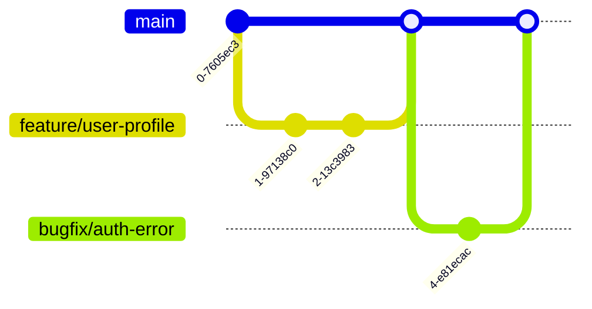

# CI/CD Guide

## Overview

MentorMatch uses a robust CI/CD (Continuous Integration/Continuous Deployment) pipeline to ensure code quality and streamline deployments. This guide explains our CI/CD architecture, processes, and best practices.

## Table of Contents

- [Architecture Overview](#architecture-overview)
- [GitHub Actions Workflows](#github-actions-workflows)
- [Vercel Deployment](#vercel-deployment)
- [Environment Variables Management](#environment-variables-management)
- [Testing in CI/CD](#testing-in-cicd)
- [Branch Strategy](#branch-strategy)
- [Best Practices](#best-practices)
- [Troubleshooting](#troubleshooting)
- [Monitoring and Metrics](#monitoring-and-metrics)

## Architecture Overview

### CI/CD Pipeline Flow


### Key Components

1. **GitHub Actions** - Automated testing and build verification
2. **Vercel** - Automated preview and production deployments
3. **Firebase** - Backend services and database
4. **npm** - Package management and dependency installation

## GitHub Actions Workflows

### Workflow File: `.github/workflows/test.yml`

This workflow runs on every push and pull request to ensure code quality.

### Jobs Overview

#### 1. Unit Tests Job (`test`)

**Purpose:** Run Jest unit tests with coverage reporting

**Triggers:**
- Every push to any branch
- Every pull request

**Steps:**
1. Checkout code
2. Setup Node.js 20.x
3. Install dependencies with `npm ci`
4. Run linter
5. Run tests with coverage
6. Upload coverage reports as artifacts

**Duration:** Approximately 30-40 seconds

**Configuration:**
```yaml
test:
  runs-on: ubuntu-latest
  steps:
    - uses: actions/checkout@v4
    - uses: actions/setup-node@v4
      with:
        node-version: '20.x'
        cache: 'npm'
    - run: npm ci
    - run: npm run lint
      continue-on-error: true
    - run: npm run test:coverage
    - uses: actions/upload-artifact@v4
      with:
        name: coverage-report
        path: coverage/
```

**Key Features:**
- Runs all Jest tests
- Generates coverage reports
- Uploads coverage as artifact with 7-day retention
- Linter failures do not block pipeline

#### 2. E2E Tests Job (`e2e`)

**Purpose:** Run Playwright end-to-end tests

**Triggers:**
- Every push to any branch
- Every pull request

**Steps:**
1. Checkout code
2. Setup Node.js 20.x
3. Install dependencies with `npm ci`
4. Install Playwright browsers (Chromium only for CI optimization)
5. Run E2E tests
6. Upload Playwright report and test results

**Duration:** Approximately 2-3 minutes

**Configuration:**
```yaml
e2e:
  name: E2E Tests (Playwright)
  runs-on: ubuntu-latest
  steps:
    - uses: actions/checkout@v4
    - uses: actions/setup-node@v4
      with:
        node-version: '20.x'
        cache: 'npm'
    - run: npm ci
    - run: npx playwright install --with-deps chromium
    - run: npm run test:e2e
      env:
        NEXT_PUBLIC_FIREBASE_API_KEY: ${{ secrets.NEXT_PUBLIC_FIREBASE_API_KEY }}
```

**Key Features:**
- Tests real user workflows
- Uses actual Firebase configuration
- Uploads test reports with 7-day retention
- Only installs Chromium to reduce CI execution time

#### 3. Build Check Job (`build-check`)

**Purpose:** Simulate Vercel's exact build process to catch deployment issues before they reach production

**Triggers:**
- Every push to any branch
- Every pull request

**Steps:**
1. Checkout code
2. Setup Node.js 20.x
3. Install dependencies using `npm install` to match Vercel's installCommand
4. Verify Vercel configuration
5. Run build simulation
6. Display build summary

**Duration:** Approximately 40-50 seconds

**Configuration:**
```yaml
build-check:
  name: Vercel Build Check
  runs-on: ubuntu-latest
  steps:
    - uses: actions/checkout@v4
    - uses: actions/setup-node@v4
      with:
        node-version: '20.x'
        cache: 'npm'
    - run: npm install
    - run: npm run build
      env:
        NODE_ENV: production
        NEXT_TELEMETRY_DISABLED: 1
```

**Why This Job Exists:**
- Prevents deployment failures by catching build errors early
- Exactly replicates Vercel's build environment
- Uses same install command as `vercel.json`
- Sets same environment variables as Vercel production

**Key Features:**
- Matches Vercel's exact build process
- Validates `vercel.json` configuration
- Catches build errors before deployment
- Provides detailed failure summaries

### Workflow Triggers

The workflow runs on:

```yaml
on:
  push:
    branches: ['*']
  pull_request:
    branches: ['*']
```

### Artifacts Generated

All artifacts are retained for 7 days:

| Artifact | Job | Contents | Size |
|----------|-----|----------|------|
| `coverage-report` | test | Jest coverage HTML/JSON | ~300 KB |
| `playwright-report` | e2e | Playwright HTML report | ~200 KB |
| `test-results` | e2e | Raw test results | Varies |

**Viewing Artifacts:**
1. Navigate to the Actions tab in GitHub
2. Click on a workflow run
3. Scroll to the "Artifacts" section at the bottom
4. Download and extract the zip file

## Vercel Deployment

### Configuration: `vercel.json`

```json
{
  "$schema": "https://openapi.vercel.sh/vercel.json",
  "buildCommand": "next build",
  "devCommand": "next dev",
  "installCommand": "npm install",
  "framework": "nextjs"
}
```

### Deployment Strategy


#### Preview Deployments

**Triggered by:** Every push to any branch except main

**Characteristics:**
- Automatic deployment for every push
- Unique URL per deployment
- Comment posted on pull requests with preview URL
- Full production build but separate environment
- Can be shared for testing and review

**Use Cases:**
- Testing features before merging
- Sharing work-in-progress with team
- QA testing
- Client previews

#### Production Deployments

**Triggered by:** Every push to `main` branch

**Characteristics:**
- Automatic deployment on main branch updates
- Uses production environment variables
- Accessible via project's production URL
- Includes all Firebase production credentials

### Vercel Build Process


### Build Output

Vercel builds include:
- Static pages (SSG)
- Server-side rendered pages (SSR)
- API routes as serverless functions
- Static assets (images, CSS, JS)

## Environment Variables Management

### Variable Types

#### 1. Client-Side Variables (NEXT_PUBLIC_*)

**Purpose:** Available in browser and during server-side rendering

**Required Variables:**
- `NEXT_PUBLIC_FIREBASE_API_KEY`
- `NEXT_PUBLIC_FIREBASE_AUTH_DOMAIN`
- `NEXT_PUBLIC_FIREBASE_PROJECT_ID`
- `NEXT_PUBLIC_FIREBASE_STORAGE_BUCKET`
- `NEXT_PUBLIC_FIREBASE_MESSAGING_SENDER_ID`
- `NEXT_PUBLIC_FIREBASE_APP_ID`

**Security Considerations:**
- Visible in browser
- Included in client-side bundle
- Safe to expose (Firebase handles auth)
- Should be domain-restricted in Firebase Console

#### 2. Server-Side Variables (FIREBASE_ADMIN_*)

**Purpose:** Server-side API operations only

**Required Variables:**
- `FIREBASE_ADMIN_PROJECT_ID`
- `FIREBASE_ADMIN_CLIENT_EMAIL`
- `FIREBASE_ADMIN_PRIVATE_KEY`

**Security Considerations:**
- Never exposed to browser
- Only available in API routes
- Highly sensitive - provides full Firebase access
- Never commit to repository

### Setting Up Environment Variables

#### GitHub Actions Secrets

**Location:** Repository Settings → Secrets and variables → Actions

**Required Secrets:**

| Secret Name | Value Source | Required For |
|-------------|--------------|--------------|
| `NEXT_PUBLIC_FIREBASE_API_KEY` | Firebase Console → Project Settings | All jobs |
| `NEXT_PUBLIC_FIREBASE_AUTH_DOMAIN` | Firebase Console → Project Settings | All jobs |
| `NEXT_PUBLIC_FIREBASE_PROJECT_ID` | Firebase Console → Project Settings | All jobs |
| `NEXT_PUBLIC_FIREBASE_STORAGE_BUCKET` | Firebase Console → Project Settings | All jobs |
| `NEXT_PUBLIC_FIREBASE_MESSAGING_SENDER_ID` | Firebase Console → Project Settings | All jobs |
| `NEXT_PUBLIC_FIREBASE_APP_ID` | Firebase Console → Project Settings | All jobs |
| `FIREBASE_ADMIN_PROJECT_ID` | Service Account JSON | Build check (optional) |
| `FIREBASE_ADMIN_CLIENT_EMAIL` | Service Account JSON | Build check (optional) |
| `FIREBASE_ADMIN_PRIVATE_KEY` | Service Account JSON | Build check (optional) |

Note: Admin credentials are optional for builds. The build will succeed without them, but runtime API features will not work until credentials are added to the deployment environment.

#### Vercel Environment Variables

**Location:** Vercel Dashboard → Project → Settings → Environment Variables

**Variable Scopes:**
- **Production** - Only for production deployments
- **Preview** - For preview deployments
- **Development** - For local development (optional)

**Important Notes:**
- Add all variables to both Production and Preview scopes
- Use separate Firebase projects for production/preview (recommended)
- Changes require redeployment to take effect

### Getting Firebase Credentials

For detailed instructions on obtaining Firebase credentials, see the [Setup Guide](../getting-started/setup-guide.md#firebase-configuration).

**Security Requirements:**
- Never commit service account JSON files
- Never commit private keys to git
- Store credentials securely using secret managers
- Rotate keys if exposed

## Testing in CI/CD

### Test Execution Strategy

#### Unit Tests (Jest)

**Coverage Requirements:**
- Overall: 70% minimum (recommended)
- New code: Aim for 80%+

**Test Categories:**
- Component tests
- Hook tests
- Service/utility tests
- API route tests
- Middleware tests

**Running Locally:**
```bash
npm test                    # Run all tests
npm run test:coverage       # Run with coverage
npm run test:watch          # Watch mode for development
npm run test:unit           # Run specific test category
npm run test:integration    # Run integration tests
```

#### E2E Tests (Playwright)

**Test Flows:**
- Student flow: authentication, dashboard, applications
- Supervisor flow: projects, applications, matching
- Admin flow: user management, system administration

**Running Locally:**
```bash
npm run test:e2e            # Run all E2E tests
npm run test:e2e:ui         # Run with UI (interactive)
npm run test:e2e:student    # Run specific flow
npm run test:e2e:supervisor # Run supervisor tests
npm run test:e2e:admin      # Run admin tests
```

**CI Optimizations:**
- Only uses Chromium browser
- Parallel test execution disabled in CI
- Retry logic for flaky tests
- Screenshot on failure

### Test Artifacts

**Coverage Reports:**
- HTML report: `coverage/lcov-report/index.html`
- JSON report: `coverage/coverage-final.json`
- Text summary in console

**Playwright Reports:**
- HTML report: `playwright-report/index.html`
- Trace files for debugging
- Screenshots of failures

## Branch Strategy

### Branch Types



#### Main Branch (`main`)

**Purpose:** Production-ready code

**Protection Rules:**
- Require pull request reviews
- Require status checks to pass
- Require branches to be up to date
- No direct pushes allowed

**Deployment:** Automatic to production on push

#### Feature Branches

**Naming Convention:**
- `feature/{feature-name}`
- `bugfix/{bug-description}`
- `hotfix/{urgent-fix}`
- `{username}-{feature-name}`

**Deployment:** Automatic preview deployment on push

### Pull Request Workflow


**Process:**
1. Create feature branch
2. Develop and commit changes
3. Push to remote (triggers CI and preview deployment)
4. Open pull request
5. Wait for CI checks to pass
6. Request code review
7. Address feedback if needed
8. Merge when approved and all checks pass
9. Automatic production deployment
10. Delete feature branch

## Best Practices

### Pre-Push Checklist

Before pushing code:

1. Run tests locally: `npm test`
2. Check linting: `npm run lint`
3. Verify build: `npm run build`
4. Type check: `npm run typecheck`

### CI/CD Optimization Tips

#### Leverage Caching

**GitHub Actions:**
- npm packages cached automatically
- Playwright browsers cached between runs

**Vercel:**
- Next.js build cache enabled
- npm dependencies cached

#### Fail Fast Strategy


#### Parallel Execution

Jobs run in parallel for faster feedback:
- Unit tests
- E2E tests
- Build check

All must pass before merge is allowed.

#### Optimize Dependencies

- Use `npm ci` in CI for faster, deterministic installs
- Use `npm install` locally for flexibility

### Security Best Practices

1. **Never Commit Secrets:**
   - Use `.gitignore` for `.env` files
   - Use GitHub Secrets for CI
   - Use Vercel Environment Variables for deployment

2. **Rotate Credentials:**
   - Rotate Firebase service account keys quarterly
   - Regenerate immediately if exposed

3. **Limit Access:**
   - Use least-privilege principle
   - Separate dev/prod Firebase projects
   - Restrict GitHub Actions permissions

4. **Monitor Logs:**
   - Review GitHub Actions logs regularly
   - Check Vercel deployment logs
   - Monitor Firebase usage and quotas

## Troubleshooting

### Common Issues

#### Firebase Admin SDK Build Failures

See the [Build Failures Troubleshooting Guide](../troubleshooting/build-failures.md) for detailed solutions.

#### E2E Tests Timeout

**Symptoms:** Playwright tests hang or timeout

**Solutions:**
1. Increase timeout in `playwright.config.ts`
2. Check if dev server started properly
3. Review browser console for errors

#### Build Succeeds but Deployment Fails

**Symptoms:** GitHub Actions passes but Vercel fails

**Solutions:**
1. Verify all Vercel environment variables are set
2. Ensure `vercel.json` configuration is correct
3. Check for build-time imports of server-only code
4. Review Vercel function size limits

#### Tests Pass Locally but Fail in CI

**Symptoms:** Different behavior in CI vs local environment

**Solutions:**
1. Verify Node version matches (20.x)
2. Use `npm ci` instead of `npm install`
3. Check for environment-specific code
4. Review timing-sensitive tests and use proper waits

### Debugging Failed Builds

#### GitHub Actions Failures

**Steps:**
1. Navigate to Actions tab
2. Click failed workflow
3. Expand failing step to view logs
4. Download artifacts for detailed analysis
5. Reproduce locally using same Node version

**Common causes:**
- Missing environment variables
- Outdated dependencies
- Flaky tests
- TypeScript errors

#### Vercel Deployment Failures

**Steps:**
1. Navigate to Vercel Dashboard
2. Click on failed deployment
3. Review build logs
4. Verify environment variables
5. Reproduce build locally with `NODE_ENV=production npm run build`

**Common causes:**
- Build-time import errors
- Missing Firebase credentials
- Next.js configuration errors
- Build timeout (increase in Vercel settings)

### Getting Help

If you encounter issues:

1. Check the [Build Failures Troubleshooting Guide](../troubleshooting/build-failures.md)
2. Review GitHub Actions logs
3. Check Vercel deployment logs
4. Search existing GitHub Issues
5. Create a new issue with error message, logs, steps to reproduce, and environment details

## Monitoring and Metrics

### GitHub Actions

**Metrics to Monitor:**
- Test pass rate
- Build duration
- Test coverage trends
- Flaky test frequency

**Viewing Metrics:**
- Actions tab → Insights
- Review workflow run history
- Track trends over time

### Vercel

**Metrics to Monitor:**
- Deployment success rate
- Build duration
- Function execution time
- Edge network performance

**Viewing Metrics:**
- Vercel Dashboard → Analytics
- Monitor production performance
- Review error logs

## Future Improvements

### Planned Enhancements

1. **Automated Dependency Updates:**
   - Dependabot for security updates
   - Weekly dependency audit

2. **Enhanced Testing:**
   - Visual regression testing
   - Performance testing
   - Accessibility testing

3. **Advanced Deployment:**
   - Canary deployments
   - Blue-green deployments
   - Automated rollback on errors

4. **Improved Monitoring:**
   - Error tracking integration
   - Performance monitoring
   - User analytics

## Related Documentation

- [Setup Guide](../getting-started/setup-guide.md) - Initial project setup and Firebase configuration
- [Development Process](../getting-started/development-process.md) - Detailed development workflow
- [Build Failures Guide](../troubleshooting/build-failures.md) - Troubleshooting build issues
- [Testing Strategy](./testing-strategy.md) - Comprehensive testing approach
- [Security Guide](./security.md) - Security best practices
