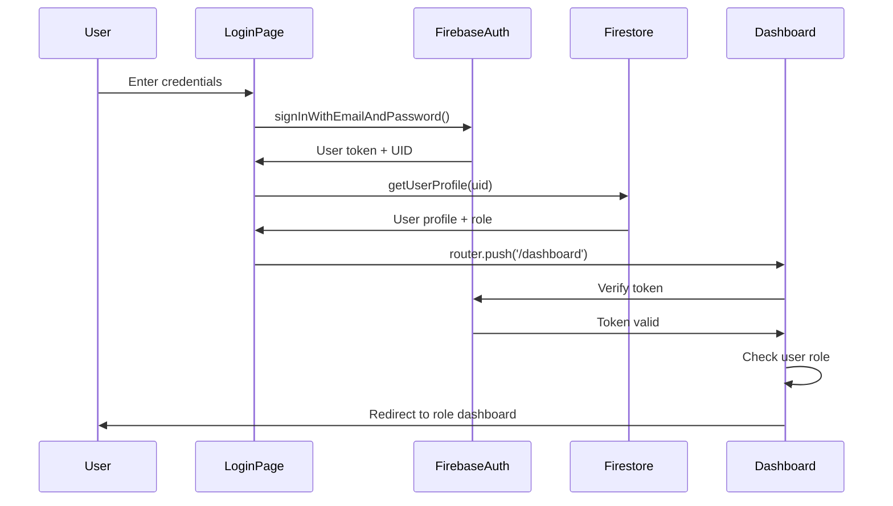
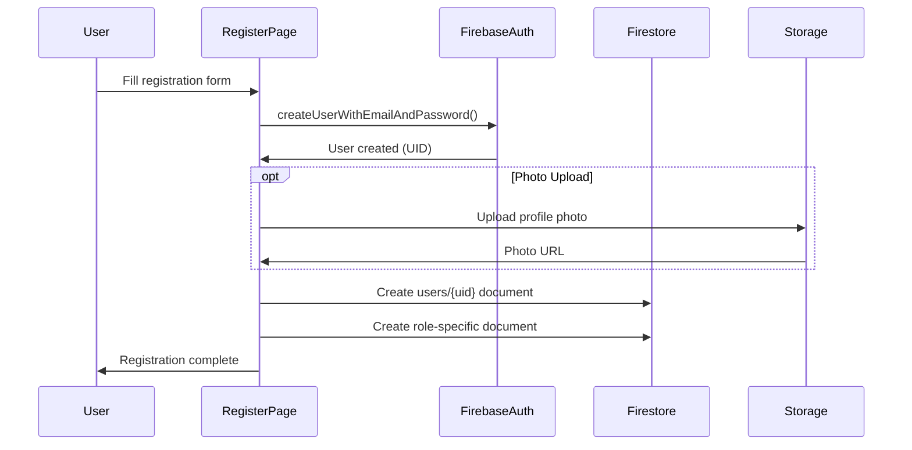

# Security Architecture

## Overview

This document consolidates security concerns for the MentorMatch platform, covering authentication, authorization, data validation, and security best practices. Security is implemented at multiple layers: client-side route protection, Firebase Authentication, and future Firestore security rules.

## Table of Contents

1. [Authentication](#authentication)
2. [Authorization](#authorization)
3. [Route Protection](#route-protection)
4. [Data Validation](#data-validation)
5. [Security Best Practices](#security-best-practices)
6. [Future: Firestore Security Rules](#future-firestore-security-rules)

---

## Authentication

### Firebase Authentication Flow

MentorMatch uses Firebase Authentication for user management with email/password authentication.

**Authentication Flow Diagram**:



### Registration Flow



### Authentication Implementation

**Location**: `lib/auth.ts`

#### Sign Up

**Implementation**: Creates Firebase Auth account, then saves user profile to Firestore users collection with user ID, email, name, role, department, and timestamp.

**Security Features**:
- Firebase handles password hashing (bcrypt)
- User ID (UID) generated by Firebase
- Email verification available (not currently implemented)

#### Sign In

**Implementation**: Uses Firebase's `signInWithEmailAndPassword` to validate credentials and return user token.

**Security Features**:
- Firebase validates credentials server-side
- Returns JWT token for session management
- Automatic rate limiting by Firebase

#### Sign Out

**Implementation**: Calls Firebase's `firebaseSignOut` to clear authentication tokens and end user session.

### Session Management

**Token Storage**:
- Firebase SDK stores auth tokens in `localStorage`
- Tokens are HTTP-only (browser-managed)
- Automatic token refresh (1 hour expiry by default)

**Session Monitoring**: Use `onAuthStateChanged` to listen for authentication state changes. Subscribe in useEffect and unsubscribe on cleanup.

### Authentication Error Handling

**Common Firebase Auth Errors**:

| Error Code | Meaning | User Message |
|------------|---------|--------------|
| `auth/email-already-in-use` | Email exists | "This email is already registered" |
| `auth/invalid-email` | Invalid format | "Please enter a valid email" |
| `auth/weak-password` | Password too short | "Password must be at least 6 characters" |
| `auth/user-not-found` | User doesn't exist | "Invalid email or password" |
| `auth/wrong-password` | Incorrect password | "Invalid email or password" |
| `auth/too-many-requests` | Rate limited | "Too many attempts. Try again later" |

**Implementation**: Handle error codes in a switch statement, combining user-not-found and wrong-password into generic "Invalid email or password" message for security.

---

## Authorization

### Role-Based Access Control (RBAC)

MentorMatch implements three user roles with different permissions:

#### Student Role

**Access**:
- `/dashboard/student/*` routes
- Own profile
- Own applications
- Browse supervisors

**Permissions**:
- Read: Own data, all supervisors
- Create: Applications
- Update: Own profile
- Delete: None

#### Supervisor Role

**Access**:
- `/dashboard/supervisor/*` routes
- Own profile
- Applications submitted to them
- Own projects

**Permissions**:
- Read: Own data, applications to self, own projects
- Create: Project suggestions
- Update: Own profile, application responses, capacity
- Delete: None

#### Admin Role

**Access**:
- `/dashboard/admin/*` routes (future)
- All users
- All applications
- All projects

**Permissions**:
- Read: All data
- Create: Manual assignments, projects
- Update: Any user, any application, any project
- Delete: Users, applications (with caution)

### Authorization Enforcement

**Client-Side** (Current Implementation):
- Route protection in layouts and pages
- Conditional rendering based on role
- Custom hooks for role verification

**Server-Side** (Future Implementation):
- Firestore security rules
- API route protection
- Server-side role validation

---

## Route Protection

### Multi-Layer Protection Strategy

```
1. Layout-Level Authentication
   ↓
2. Page-Level Authorization
   ↓
3. Component-Level Rendering
```

### Layout-Level Authentication

**Implementation**: `app/dashboard/layout.tsx` - Monitors authentication state, redirects unauthenticated users to home, fetches user profile, and provides user context to children.

**Protection Level**: Prevents access without authentication

### Page-Level Authorization

**Implementation**: Custom auth hooks (e.g., `useSupervisorAuth` in `lib/hooks/`) - Verify authentication, check user role, redirect if role mismatch, return user ID, profile, and loading state.

**Usage**: Call hook in page component, handle loading state, hook automatically redirects if unauthorized.

**Protection Level**: Ensures user has correct role for route

### Component-Level Rendering

**Conditional UI Based on Role**: Use ternary operators or && conditionals to show/hide UI elements based on `user?.role` checks.

### Navigation Patterns

**router.replace() vs router.push()**:
- **`router.replace()`**: For auth redirects (no back button in history)
- **`router.push()`**: For user-initiated navigation (adds to history)

---

## Data Validation

### Client-Side Validation

**Purpose**: User experience (immediate feedback)

**Implementation**: Form validation before submission using regex patterns for email, length checks for password, and trimmed checks for required fields.

**Validation Rules**:
- Email: Valid format, not empty
- Password: Minimum 6 characters (Firebase requirement)
- Names: Not empty, no special characters
- Phone: Valid format (optional)
- Student ID: Matches college format

### Server-Side Validation

**Current Status**: Limited server-side validation

**Firebase Auth** provides:
- Email format validation
- Password strength validation
- Rate limiting

**Future Implementation**: Firestore security rules (see below)

### Input Sanitization

**Purpose**: Prevent XSS and injection attacks

**Implementation**:
- React automatically escapes strings in JSX
- No `dangerouslySetInnerHTML` usage
- User input never directly inserted into HTML

**Best Practices**: Use JSX curly braces for user input (React auto-escapes). Avoid `dangerouslySetInnerHTML` with user input.

---

## Security Best Practices

### 1. Environment Variables

**Never expose secrets in client code**:
- Public config: Use `NEXT_PUBLIC_` prefix for client-accessible variables (Firebase API key, project ID)
- Server secrets: Never prefix with `NEXT_PUBLIC_` (admin keys, service account keys)
- Access via `process.env.NEXT_PUBLIC_VARIABLE_NAME`

**Note**: Firebase API keys are **intentionally public** (they're not secrets). Security is enforced by Firestore rules and Auth configurations.

### 2. XSS Prevention

**React Built-in Protection**:
- Automatic escaping of JSX content
- No inline event handlers in strings
- Avoid `element.innerHTML` with user input
- Use JSX curly braces for safe rendering

### 3. CSRF Protection

**Next.js Built-in Protection**:
- SameSite cookies
- Origin checking
- No additional CSRF tokens needed

### 4. Password Security

**Firebase Handles**:
- Bcrypt hashing
- Salt generation
- Secure storage

**Never**:
- Store passwords in plain text
- Log passwords
- Send passwords in URLs
- Display passwords in error messages

### 5. Secure File Uploads

**Current Implementation** (Profile Photos): Validate file type against allowed list (JPEG, PNG, GIF), check file size against 5MB limit, upload to user-specific folder with timestamp filename.

**Security Measures**:
- File type validation
- File size limits
- User-specific folders (prevents overwriting)
- Timestamp in filename (prevents conflicts)

### 6. Rate Limiting

**Firebase Auth** provides built-in rate limiting:
- Too many login attempts → temporary lockout
- Too many password resets → delay
- DDoS protection at Firebase level

**Future**: Implement application-level rate limiting for API calls

### 7. Secure Communication

**HTTPS Everywhere**:
- Vercel enforces HTTPS
- Firebase connections use HTTPS
- No mixed content

### 8. Error Messages

**Don't leak information**: Use generic error messages that don't reveal whether user exists or which field is incorrect (e.g., "Invalid email or password" instead of "User not found").

### 9. Logging Security

**Do Log**:
- Authentication attempts (success/failure)
- Authorization failures
- Unusual patterns

**Don't Log**:
- Passwords
- Session tokens
- Personal identifiable information (PII)
- Credit card numbers

**Current Implementation**: Log error objects without sensitive data. Never log passwords, tokens, or PII.

---

## Future: Firestore Security Rules

### Current Status

**Not Yet Implemented** - All security is client-side

**Risk Level**: Medium
- Academic project with trusted users
- No sensitive personal data
- Firebase Auth provides user isolation

**Timeline**: Should be implemented before production deployment

### Planned Security Rules

**Firestore Rules** (to be implemented):
- Helper functions: `isAuthenticated()`, `isOwner(userId)`, `hasRole(role)`
- Users: Read if authenticated, write if owner
- Students/Supervisors: Read if authenticated, write if owner or admin
- Applications: Read if student/supervisor/admin involved, create if student, update if supervisor/admin
- Projects: Read if authenticated, create if supervisor/admin, update if supervisor owner or admin
- Admins: Read/write only if admin role

**Firebase Storage Rules** (to be implemented):
- Profile photos: Users can only upload to their own folder, 5MB limit, image types only
- Anyone authenticated can read photos

### Testing Security Rules

**Firebase Emulator**: Use `firebase emulators:start --only firestore` to test locally

**Test in Firebase Console**:
- Rules Playground feature
- Test read/write operations
- Verify role-based access

---

## Security Checklist

### Pre-Production

- [ ] Implement Firestore security rules
- [ ] Implement Storage security rules
- [ ] Test all security rules thoroughly
- [ ] Enable email verification for new accounts
- [ ] Set up monitoring and alerts
- [ ] Review all authentication error messages
- [ ] Audit environment variables
- [ ] Remove development/test accounts
- [ ] Enable Firebase App Check (optional)
- [ ] Set up backup strategy

### Ongoing Maintenance

- [ ] Regular security audits
- [ ] Monitor Firebase Console for unusual activity
- [ ] Keep Firebase SDK updated
- [ ] Review and update security rules as features change
- [ ] Test authentication flows regularly
- [ ] Monitor for security vulnerabilities in dependencies

---

## Security Incident Response

### If Breach Detected

1. **Immediate Actions**:
   - Disable affected user accounts
   - Revoke active sessions
   - Change Firebase admin credentials

2. **Investigation**:
   - Review Firebase Auth logs
   - Check Firestore activity logs
   - Identify scope of breach

3. **Communication**:
   - Notify affected users
   - Coordinate with university IT
   - Document incident

4. **Recovery**:
   - Patch vulnerabilities
   - Restore from backups if needed
   - Re-enable service when secure

5. **Post-Incident**:
   - Review and update security policies
   - Implement additional monitoring
   - Update documentation

---

## Related Documentation

- `docs/firebase-usage.md` - Firebase configuration and setup
- `docs/system-architecture.md` - Overall system architecture
- `docs/api-reference.md` - Service layer implementation
- `docs/dashboard-architecture.md` - Route structure and protection

## External Resources

- [Firebase Security Rules Documentation](https://firebase.google.com/docs/rules)
- [Firebase Auth Best Practices](https://firebase.google.com/docs/auth/best-practices)
- [OWASP Top 10](https://owasp.org/www-project-top-ten/)
- [Next.js Security Best Practices](https://nextjs.org/docs/app/building-your-application/authentication)

