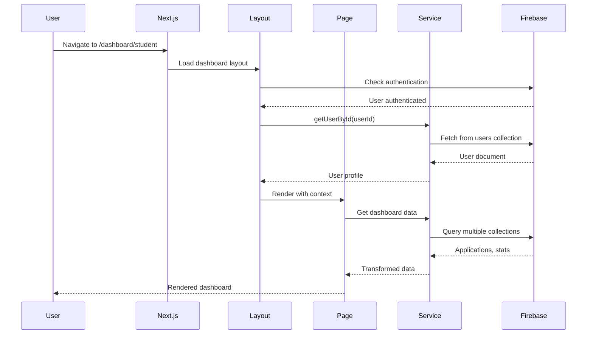
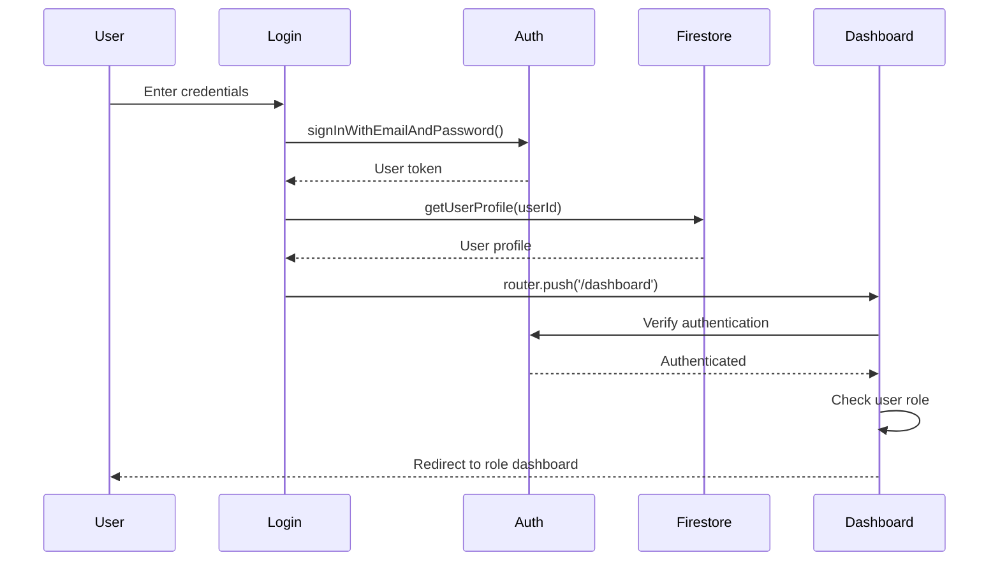

# System Architecture

## Overview

MentorMatch is a web-based platform built with modern technologies to facilitate project supervisor matching at Braude College of Engineering. The system follows a serverless architecture pattern using Next.js for the frontend and Firebase for backend services.

## High-Level Architecture

```mermaid
graph TB
    User[User Browser] --> NextJS[Next.js 14 App Router]
    NextJS --> Auth[Firebase Authentication]
    NextJS --> Firestore[Cloud Firestore]
    NextJS --> Storage[Firebase Storage]
    
    Auth --> Users[Users Collection]
    Firestore --> Users
    Firestore --> Students[Students Collection]
    Firestore --> Supervisors[Supervisors Collection]
    Firestore --> Applications[Applications Collection]
    Firestore --> Projects[Projects Collection]
    Firestore --> Admins[Admins Collection]
    
    Storage --> Photos[Profile Photos]
    
    NextJS --> Vercel[Vercel Deployment]
    
    style NextJS fill:#0070f3
    style Auth fill:#ffca28
    style Firestore fill:#ffca28
    style Storage fill:#ffca28
    style Vercel fill:#000
```



## Technology Stack

### Frontend Layer

**Next.js 14 (App Router)**
- **Why**: Modern React framework with server-side rendering, file-based routing, and excellent developer experience
- **Benefits**: Automatic code splitting, optimized performance, built-in routing, SEO-friendly
- **Version**: 14.2.33

**TypeScript**
- **Why**: Type safety reduces bugs and improves maintainability
- **Benefits**: IntelliSense, compile-time error detection, self-documenting code
- **Version**: 5.x

**Tailwind CSS**
- **Why**: Utility-first CSS framework with excellent customization
- **Benefits**: Consistent design system, small bundle size with purging, rapid development
- **Version**: 3.4.1
- **Custom Strategy**: Hybrid approach (see `docs/tailwind-usage.md`)

### Backend Layer

**Firebase Services**
- **Why**: Serverless backend reduces infrastructure complexity and costs
- **Benefits**: Scalability, real-time capabilities, authentication built-in, generous free tier

**Cloud Firestore** (NoSQL Database)
- **Why**: Flexible schema, real-time updates, offline support
- **Collections**: users, students, supervisors, applications, projects, admins
- **Version**: 12.6.0

**Firebase Authentication**
- **Why**: Secure authentication with minimal setup
- **Features**: Email/password auth, session management, token refresh

**Firebase Storage**
- **Why**: Scalable file storage for profile photos
- **Structure**: Organized by user ID with timestamps

### Testing Stack

**Jest + React Testing Library**
- **Why**: Industry standard for React testing
- **Coverage**: 80%+ test coverage target
- **See**: `docs/testing-strategy.md`

### Deployment

**Vercel**
- **Why**: Optimized for Next.js, automatic deployments, edge network
- **Features**: Preview deployments, automatic HTTPS, global CDN

**GitHub Actions**
- **Why**: CI/CD pipeline for automated testing and build verification
- **Features**: Test execution, build checks, pre-commit hooks (Husky)

## Application Layers

### 1. Presentation Layer (`app/`, `components/`)

**Responsibilities**:
- Render UI components
- Handle user interactions
- Display data from service layer
- Manage client-side state (React Context)
- Route protection and navigation

**Key Patterns**:
- File-based routing with Next.js App Router
- Client components for interactivity
- Server components for initial data fetching (future)
- Reusable component library

**Structure**:
```
app/
├── layout.tsx              # Root layout
├── page.tsx                # Home page
├── login/                  # Authentication pages
├── register/
├── profile/                # User profile
├── dashboard/              # Role-based dashboards
│   ├── layout.tsx          # Dashboard layout with auth
│   ├── page.tsx            # Dashboard router
│   ├── student/            # Student-specific pages
│   └── supervisor/         # Supervisor-specific pages
└── components/             # Reusable components
    ├── Header.tsx
    ├── Footer.tsx
    └── dashboard/          # Dashboard-specific components
```

### 2. Service Layer (`lib/services/`)

**Responsibilities**:
- Abstract Firebase SDK operations
- Provide clean API for data access
- Handle errors gracefully
- Transform data between Firebase and application formats
- Centralize business logic

**Benefits**:
- Testability (easy to mock)
- Maintainability (single source of truth)
- Separation of concerns (UI doesn't know about Firebase details)

**Services**:
- `UserService` - User profile operations
- `StudentService` - Student-specific operations
- `SupervisorService` - Supervisor operations
- `ApplicationService` - Application CRUD operations
- `ProjectService` - Project management
- `AdminService` - Admin dashboard operations

**See**: `docs/api-reference.md` for detailed API documentation

### 3. Data Access Layer (Firebase)

**Firestore Collections Structure**:

```
Firestore Database
├── users/                  # Base user profiles
│   └── {userId}
├── students/               # Student details
│   └── {userId}
├── supervisors/            # Supervisor profiles
│   └── {userId}
├── applications/           # Project applications
│   └── {applicationId}
├── projects/               # Active projects
│   └── {projectId}
└── admins/                 # Admin profiles
    └── {userId}
```

**Data Access Patterns**:
- Direct document reads by ID for single entities
- Filtered queries for collections (by status, role, department)
- Composite indexes for complex queries
- Data transformation in service layer

**See**: `docs/firebase-usage.md` for detailed Firebase documentation

## Request/Response Flow

### Typical Page Load Flow



### Authentication Flow



## Role-Based Access Architecture

### User Roles

**Student**
- Access: `/dashboard/student/*`
- Features: Browse supervisors, submit applications, track status
- Data Access: Own profile, own applications, all supervisors

**Supervisor**
- Access: `/dashboard/supervisor/*`
- Features: View applications, manage capacity, respond to requests
- Data Access: Own profile, applications to self, own projects

**Admin**
- Access: `/dashboard/admin/*` (future)
- Features: Manage all users, assign students, view reports
- Data Access: All collections (full access)

### Route Protection Strategy

1. **Layout-Level Authentication** (`app/dashboard/layout.tsx`)
   - Verify user is authenticated
   - Fetch user profile
   - Redirect unauthenticated users to home

2. **Page-Level Authorization**
   - Check user role matches route requirements
   - Custom hooks for role verification (e.g., `useSupervisorAuth`)
   - Redirect to appropriate dashboard if role mismatch

3. **Component-Level Rendering**
   - Conditional rendering based on user role
   - Hide/show features based on permissions

## State Management

### Context-Based State

**DashboardContext** (`app/dashboard/DashboardContext.tsx`)
- **Scope**: All dashboard routes
- **Data**: User profile, authentication state, loading state
- **Why**: Avoid prop drilling, share auth state across dashboard

### Local Component State

**React useState/useEffect**
- **Scope**: Individual components
- **Data**: Form inputs, UI state, temporary data
- **Why**: Simple, no external dependencies needed

### No Global State Library

**Decision**: No Redux, Zustand, or similar
**Reasoning**: 
- Application state is simple (user profile + page data)
- Context API sufficient for current needs
- Reduces bundle size and complexity
- Can add later if needed

## Key Design Decisions

### 1. Service Layer Pattern

**Decision**: Centralize all Firebase operations in service layer
**Alternatives Considered**: Direct Firebase SDK calls in components
**Reasoning**:
- Easier testing (mock services, not Firebase)
- Consistent error handling
- Single source of truth for data operations
- Can swap backend without changing components

### 2. Multi-Route Dashboard

**Decision**: Separate routes for each role (`/dashboard/student`, `/dashboard/supervisor`)
**Alternatives Considered**: Single dashboard with conditional rendering
**Reasoning**:
- Better code splitting (load only needed code)
- Cleaner URLs (bookmarkable, shareable)
- Easier testing (independent test suites)
- Scalability (easy to add new roles)
- Team collaboration (avoid merge conflicts)

**See**: `docs/dashboard-architecture.md` for detailed rationale

### 3. Hybrid Tailwind Strategy

**Decision**: Combine Tailwind utilities with custom component classes
**Alternatives Considered**: Pure utility classes everywhere
**Reasoning**:
- Reduce class duplication
- Easier maintenance (update in one place)
- Consistent design patterns
- Better readability

**See**: `docs/tailwind-usage.md` for implementation details

### 4. Firebase over Custom Backend

**Decision**: Use Firebase for all backend services
**Alternatives Considered**: Node.js/Express backend, other BaaS
**Reasoning**:
- Rapid development (no backend code to write)
- Automatic scaling
- Real-time capabilities built-in
- Cost-effective for academic project
- Focus on frontend features

### 5. TypeScript Throughout

**Decision**: Use TypeScript for all code
**Alternatives Considered**: JavaScript with JSDoc
**Reasoning**:
- Catch errors at compile time
- Better IDE support
- Self-documenting code
- Easier refactoring

## Deployment Architecture

### Production Environment (Vercel)

```
GitHub Repository
    ↓ (push to main)
Vercel Automatic Deployment
    ↓
Edge Network (Global CDN)
    ↓
User Request → Nearest Edge Location
```

**Features**:
- Automatic deployments on push
- Preview deployments for PRs
- Edge caching for static assets
- Serverless functions (if needed)
- Environment variables management

### CI/CD Pipeline (GitHub Actions)

**Workflow**: `.github/workflows/test.yml`

```
Push/PR → GitHub Actions
    ↓
1. Install Dependencies
    ↓
2. Run Tests
    ↓
3. Build Check (next build)
    ↓
4. Coverage Report
    ↓
Success/Failure Status
```

**Benefits**:
- Early detection of issues
- No broken code in main branch
- Transparent for all team members
- Pre-commit hooks prevent bad commits

## Performance Considerations

### Code Splitting

**Automatic**: Next.js App Router automatically splits code by route
**Result**: Users only download JavaScript for the current page

### Loading States

**Strategy**: Show skeleton loaders while data fetches
**Implementation**: Loading states in all data-fetching components
**Benefit**: Better perceived performance

### Caching Strategy

**Current**: No aggressive caching (academic project, data changes frequently)
**Future**: Can add SWR or React Query for advanced caching

### Firestore Query Optimization

- Indexed queries for performance
- Specific field selection (future optimization)
- Batch reads with `Promise.all()` for parallel fetching

## Security Architecture

### Authentication Security

- Firebase handles token management
- Tokens stored in HttpOnly cookies (Firebase SDK)
- Automatic token refresh
- Session timeout handled by Firebase

### Authorization Security

- Client-side route guards
- Server-side Firestore rules (to be implemented)
- Role verification at page level
- No sensitive data in client code

**See**: `docs/security.md` for complete security documentation

## Scalability Considerations

### Current Scale

- Target: ~500 students, ~50 supervisors per semester
- Expected Load: Low (academic environment)
- Peak Times: Application deadline periods

### Firebase Limits (Free Tier)

- 50,000 document reads/day
- 20,000 document writes/day
- 1GB storage
- **Current Usage**: Well within limits

### Future Scaling Options

1. **Upgrade Firebase Plan** if limits approached
2. **Implement Caching** to reduce database reads
3. **Optimize Queries** with proper indexing
4. **Add Rate Limiting** to prevent abuse

## Development Workflow

```
Feature Branch → Write Tests (TDD) → Implement → Local Tests Pass
    ↓
Commit (Pre-commit hooks run tests) → Push
    ↓
GitHub Actions (Tests + Build Check) → Pass
    ↓
Create Pull Request → Code Review
    ↓
Merge to Main → Vercel Deploys Automatically
```

## Documentation Structure

This architecture documentation is part of a comprehensive documentation system:

- `system-architecture.md` (this file) - System overview
- `api-reference.md` - Service layer API documentation
- `firebase-usage.md` - Firebase integration guide
- `testing-strategy.md` - Testing approach and tools
- `dashboard-architecture.md` - Dashboard-specific architecture
- `tailwind-usage.md` - CSS architecture and patterns
- `development-process.md` - Development history and decisions
- `type-system.md` - TypeScript types and data contracts
- `code-conventions.md` - Coding standards
- `security.md` - Security architecture
- `component-library.md` - Reusable component catalog
- `data-flow.md` - State management and data flow

## Resources

### External Documentation
- [Next.js 14 Documentation](https://nextjs.org/docs)
- [Firebase Documentation](https://firebase.google.com/docs)
- [TypeScript Documentation](https://www.typescriptlang.org/docs/)
- [Tailwind CSS Documentation](https://tailwindcss.com/docs)

### Internal Files
- `package.json` - Dependencies and scripts
- `tsconfig.json` - TypeScript configuration
- `tailwind.config.ts` - Tailwind customization
- `jest.config.js` - Test configuration
- `vercel.json` - Deployment configuration

