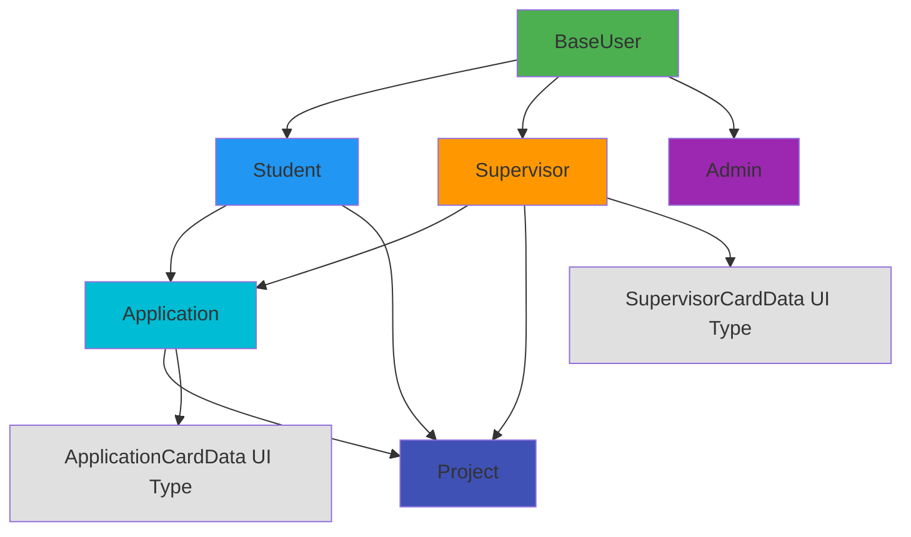

# Type System Documentation

## Overview

MentorMatch uses TypeScript throughout the codebase to ensure type safety, catch errors at compile-time, and provide excellent IntelliSense support. This document describes the type system architecture, core types, and guidelines for working with types.

**Type Definition Files**:
- `types/database.ts` - Database entity types (Firestore collections)
- `types/user.ts` - User-related types (legacy, mostly superseded by database.ts)
- `types/dashboard.ts` - Dashboard-specific types (legacy, mostly superseded by database.ts)

## Type Organization

### Database Types (`types/database.ts`)

Core entity types representing Firestore collections and their data structures. These are the primary types used throughout the application.

### Helper Types

UI-specific types that transform database types for display purposes (e.g., `SupervisorCardData`, `ApplicationCardData`).

### Type Aliases

Union types for status fields and enums (e.g., `ApplicationStatus`, `UserRole`).

---

## Core Database Types

### BaseUser

Base user interface stored in the `users` collection. All users have this minimal profile.

**Collection**: `users/`

**Definition**: `types/database.ts` (lines 7-16)

**Fields**:
- `email` (string): User's email address (from Firebase Auth)
- `name` (string): Full display name
- `role` (string): User's role in the system
- `photoURL` (string, optional): URL to profile photo in Firebase Storage
- `department` (string, optional): Academic department
- `createdAt` (Date): Account creation timestamp
- `updatedAt` (Date, optional): Last profile update timestamp

**Usage**: Authentication, user identification, role-based routing

**Related Services**: `UserService.getUserById()`, `UserService.getAllUsers()`

---

### Student

Extended user type for students, stored in the `students` collection.

**Collection**: `students/`

**Definition**: `types/database.ts` (lines 21-55)

**Key Fields**:
- `studentId`: Unique student identifier (academic ID)
- `matchStatus`: Current matching state ('unmatched' | 'pending' | 'matched')
- `skills`: Comma-separated skills (stored as string for simplicity)
- `hasPartner`: Whether student has a project partner
- `profileComplete`: Whether student completed registration

**Usage**: Student dashboard, application submissions, admin assignment

**Related Services**: `StudentService.getStudentById()`, `StudentService.getUnmatchedStudents()`

---

### Supervisor

Supervisor profile stored in the `supervisors` collection.

**Collection**: `supervisors/`

**Definition**: `types/database.ts` (lines 60-98)

**Key Fields**:
- `maxCapacity`: Maximum number of projects supervisor can handle
- `currentCapacity`: Current number of active projects
- `availabilityStatus`: Availability for new students (computed from capacity)
- `isApproved`: Whether admin has approved this supervisor
- `isActive`: Whether supervisor account is active

**Capacity Logic**: Status computed based on current vs. maximum capacity - unavailable when at max, limited when one slot remaining, available otherwise.

**Usage**: Supervisor dashboard, student browsing, application management

**Related Services**: `SupervisorService.getSupervisorById()`, `SupervisorService.getAvailableSupervisors()`

---

### Admin

Administrator profile stored in the `admins` collection.

**Collection**: `admins/`

**Definition**: `types/database.ts` (lines 103-124)

**AdminPermission Type**: `types/database.ts` (lines 126-135)

**Admin Roles**:
- `project_coordinator`: Manages project assignments and matching
- `department_secretary`: Handles administrative tasks
- `system_admin`: Full system access

**Usage**: Admin dashboard, user management, reporting

**Related Services**: `AdminService.getAdminById()`

---

### Application

Project application stored in the `applications` collection.

**Collection**: `applications/`

**Definition**: `types/database.ts` (lines 156-194)

**ApplicationStatus Type**: `types/database.ts` (line 151)

**Status Flow**: pending → under_review → approved/rejected/revision_requested

**Key Fields**:
- `id`: Firestore document ID
- `isOwnTopic`: Whether student proposed their own topic (vs. selecting from supervisor's topics)
- `studentSkills`/`studentInterests`: Snapshot of student info at application time
- `responseDate`: Set when status becomes 'approved' or 'rejected'

**Usage**: Application submission, supervisor review, status tracking

**Related Services**: `ApplicationService.getStudentApplications()`, `ApplicationService.getSupervisorApplications()`

---

### Project

Active project stored in the `projects` collection.

**Collection**: `projects/`

**Definition**: `types/database.ts` (lines 199-224)

**Project Code Format**: `YEAR-SEMESTER-DEPT-NUM` (e.g., "25-2-D-01" for 2025, Semester 2, Department D, Project 01)

**Status Flow**: pending_approval → approved → in_progress → completed

**Usage**: Project tracking, supervisor workload, admin reporting

**Related Services**: `ProjectService.getProjectById()`, `ProjectService.getSupervisorProjects()`

---

## Helper Types for UI

### SupervisorCardData

Transformed supervisor data for display in cards.

**Definition**: `types/database.ts` (lines 229-239)

**Differences from Supervisor**:
- `name`: Single string (vs. firstName/lastName)
- `currentCapacity`: Formatted string "X/Y projects" (vs. separate numbers)
- `contact`: Email as contact field
- Omits: internal fields (isApproved, isActive, notificationPreference)

**Source**: `SupervisorService.getAvailableSupervisors()` transforms `Supervisor` to this format

**Usage**: Student browsing supervisors, supervisor cards in UI

---

### ApplicationCardData

Transformed application data for display in cards.

**Definition**: `types/database.ts` (lines 241-250)

**Differences from Application**:
- `dateApplied`: Formatted string (vs. Date object)
- `comments`: Alias for supervisorFeedback
- Omits: participant details, student info snapshot

**Source**: `ApplicationService.getStudentApplications()` transforms `Application` to this format

**Usage**: Student dashboard, application lists

---

### DashboardStats

Aggregated statistics for admin dashboard.

**Definition**: `types/database.ts` (lines 252-257)

**Source**: `AdminService.getDashboardStats()` computes from multiple collections

**Usage**: Admin dashboard overview

---

## Type Relationships



**Inheritance Pattern**:
- All users have `BaseUser` properties
- Role-specific types extend with additional fields
- UI types transform database types for display

---

## Type Guards

### Role Type Guards

Useful for narrowing user types based on role.

**Pattern**: Create functions that check `user.role` and return type predicates (`user is Student`)

**Usage**: Use in conditional statements to narrow TypeScript types based on runtime checks

**Note**: These are recommended patterns - not currently implemented in codebase. Consider adding to `lib/type-guards.ts` if needed.

---

## Type Conventions

### Naming Conventions

1. **Interfaces**: PascalCase (e.g., `Student`, `Application`)
2. **Type Aliases**: PascalCase (e.g., `ApplicationStatus`, `AdminPermission`)
3. **Enums**: PascalCase with UPPER_SNAKE_CASE values (not using enums currently)

### Optional vs Required Fields

**Guidelines**:
- Required: Fields that must exist at creation
- Optional (`?`): Fields that may not be set initially or are truly optional
- Example: `photoURL?` is optional because users may not upload a photo

### Date Types

**Consistency**: Use JavaScript `Date` objects throughout the application

**Firestore Conversion**: Services automatically convert Firestore Timestamps to Dates using optional chaining and ternary operators

**UI Formatting**: Convert to strings in UI layer using `.toLocaleDateString()` or similar methods

---

## Working with Types

### Creating New Types

**When to create a new type**:
1. Represents a distinct entity or concept
2. Used in multiple places
3. Has a specific structure that should be enforced

**Where to add**:
- Database entities → `types/database.ts`
- UI-specific types → Same file as database types (helper types section)
- Component-specific types → Define in component file

**Example**: Adding a new optional field like `priority` to an existing interface in `types/database.ts`

### Extending Existing Types

**Use `Partial<T>`** when you need some fields optional:
```typescript
async function updateStudent(
  studentId: string, 
  data: Partial<Student>
): Promise<boolean> {
  // data can contain any subset of Student fields
}
```

**Use `Omit<T, K>`** when creating without specific fields:
```typescript
async function createApplication(
  applicationData: Omit<Application, 'id'>
): Promise<string | null> {
  // applicationData has all fields except 'id'
}
```

**Use `Pick<T, K>`** when you need only specific fields:
```typescript
type UserBasicInfo = Pick<BaseUser, 'name' | 'email' | 'role'>;
```

### Type Assertions

**Avoid when possible**, but use when necessary:
```typescript
const data = doc.data() as Student;
```

**Better**: Use type guards or explicit validation

---

## Common Type Patterns

### Pattern 1: Service Return Types

- **Single item**: Return `Type | null` for get-by-id operations
- **Multiple items**: Return `Type[]` (empty array on error)
- **Boolean operations**: Return `boolean` for update/delete success
- **Create operations**: Return `string | null` for new document ID

### Pattern 2: Component Props

Define props interface with component name + "Props" suffix. Use optional props with `?` for callbacks and optional configuration.

### Pattern 3: State Types

Use explicit types for state: `Type | null` for optional data, `boolean` for flags, `string | null` for error messages.

### Pattern 4: Event Handlers

Use React event types (`React.FormEvent`, `React.MouseEvent`) or plain parameter types for callbacks.

---

## Type Safety Best Practices

### Do's

1. **Always define explicit return types for functions** - Makes code self-documenting and catches errors early
2. **Use interfaces for objects, types for unions** - Interfaces for data structures, types for string literals and unions
3. **Check for null/undefined before using** - Always verify data exists before accessing properties
4. **Use TypeScript strict mode** - Enable in `tsconfig.json` for maximum type safety

### Don'ts

1. **Don't use `any`** - Defeats TypeScript's purpose; use proper types or `unknown` if type is truly unknown
2. **Don't ignore type errors** - Fix the underlying issue or handle edge cases properly instead of suppressing with `@ts-ignore`
3. **Don't use type assertions without validation** - Use type guards to narrow types safely at runtime

---

## Migration Notes

### Legacy Types

**`types/user.ts`** - Original simple user type
- Superseded by `BaseUser`, `Student`, `Supervisor` from `database.ts`
- Still exists for backward compatibility
- Avoid using in new code

**`types/dashboard.ts`** - Original dashboard types
- Contains simplified `Application` and `Supervisor` types
- Superseded by full types in `database.ts`
- Avoid using in new code

### Future Improvements

1. **Consolidate type files** - Remove legacy types completely
2. **Add type guards** - Implement runtime type checking
3. **Add Zod/Joi schemas** - Runtime validation for Firebase data
4. **Generate types** - Consider code generation from Firestore schema

---

## Related Documentation

- `docs/api-reference.md` - Service methods using these types
- `docs/firebase-usage.md` - How types map to Firestore collections
- `docs/system-architecture.md` - Overall architecture context
- `docs/code-conventions.md` - TypeScript coding standards

## File Reference

**Type Definitions**:
- `types/database.ts` - Main type definitions
- `types/user.ts` - Legacy user types
- `types/dashboard.ts` - Legacy dashboard types
- `types/index.ts` - Type exports (currently empty)

